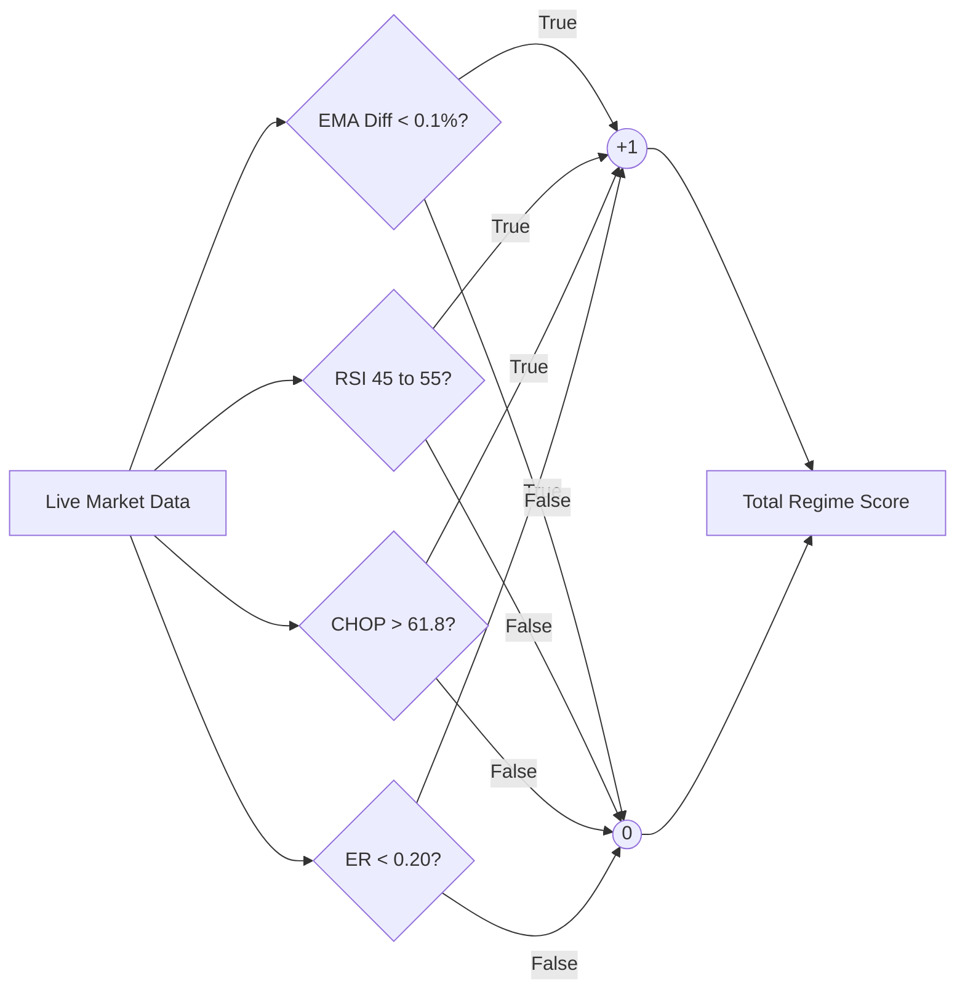
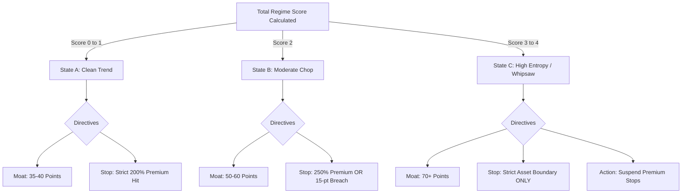

# 0DTE Algorithmic Decision Support System

**System Architecture & State Rules - Version 1.1**

## 1. Core Philosophy

The objective of this algorithm is to act as a **Human-in-the-Loop Regime Classifier**. It ingests live market telemetry to determine the current operational environment (State) and outputs dynamic structural constraints (Moat Width, Stop-Loss Limits) to protect short premium positions from intraday structural failures.

## 2. Telemetry Ingestion (The Ensemble Matrix)

The engine currently monitors the following metrics on a **5-Minute timeframe** and assigns a `+1` penalty score for every condition that indicates inefficiency or chop. The total score determines the market state.

* **Moving Average Compression:** EMA 9 and EMA 21
  * *Trigger:* Absolute difference between EMAs is less than 0.1% of the current price. (+1 Score)
* **Oscillator Exhaustion:** RSI (14)
  * *Trigger:* RSI is in the "Dead Zone" between 45 and 55. (+1 Score)
* **Trend Inefficiency:** Choppiness Index (CHOP 14)
  * *Trigger:* CHOP is greater than the Fibonacci threshold of 61.8. (+1 Score)
* **Price Path Inefficiency:** Kaufman's Efficiency Ratio (ER 10)
  * *Trigger:* ER is less than 0.20, indicating high noise relative to net movement. (+1 Score)

### The Ensemble Voting Flow

## 3. The State Machine Routing

## 4. Operational Regimes & Rules

### State A: Clean Trend

* **Definition:** The market has a clear, unchallenged directional bias. Moving averages are separated, CHOP is low, and ER is high.
* **Score:** `0 to 1`
* **Directional Bias:** Allowed (Put Spreads if Bullish, Call Spreads if Bearish).
* **Moat Requirement:** 35 - 40 Points.
* **Risk Protocol:** *Rigid Premium Hits.* Because the trend is clear, any sudden spike in premium indicates the trend is failing. Stop-loss hardcoded to 200% of collected credit.

### State B: Moderate Chop

* **Definition:** The market is consolidating or building energy. Indicators are mixed, showing mild inefficiencies.
* **Score:** `2`
* **Directional Bias:** Neutral to Mild. Strongly prefer Iron Condors.
* **Moat Requirement:** 50 - 60 Points.
* **Risk Protocol:** *Hybrid.* Expand stop losses to 250% of credit collected to absorb localized noise and standard IV fluctuations, or use a 15-point asset boundary.

### State C: High Entropy / Whipsaw

* **Definition:** The market is violently fluctuating with no directional progress. High CHOP, low ER, compressed EMAs, and RSI stuck in the dead zone.
* **Score:** `3 or 4`
* **Directional Bias:** Strictly Neutral. Do not deploy single directional wings.
* **Moat Requirement:** 70+ Points.
* **Risk Protocol:** *Asset Boundary Only.* Do not exit trades based on premium (which will falsely trigger due to erratic IV expansion). Exit *only* if the underlying asset's spot price breaches within a predetermined distance of the short strike.

## 5. System Modification Log

* **[2026-05-18] - V1.1:** Upgraded logic to Multi-Factor Ensemble Model. Integrated Choppiness Index (CHOP) and Kaufman's Efficiency Ratio (ER) as primary state triggers. Added explicit scoring thresholds.
* **[V1.0]:** Initialized MVP with EMA compression and RSI Dead Zone constraints.